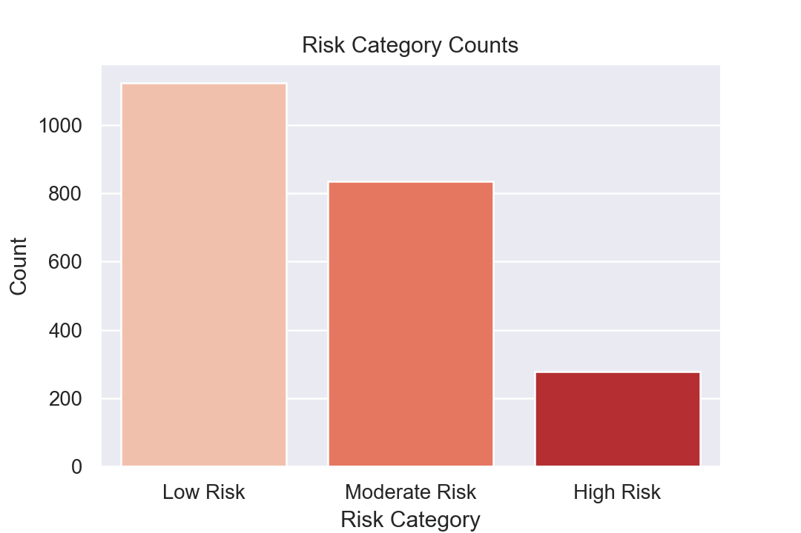
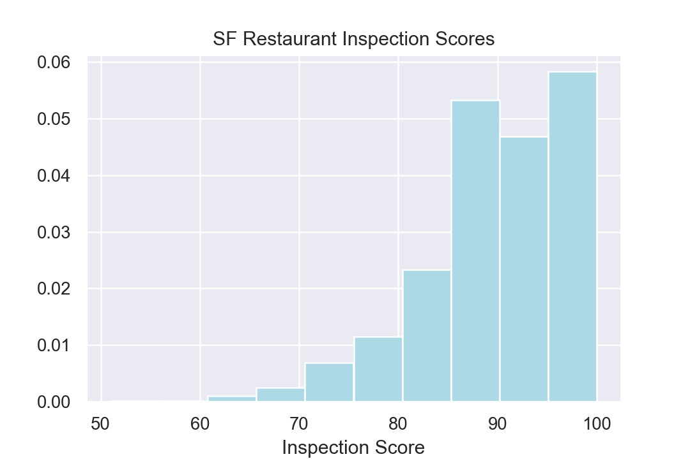
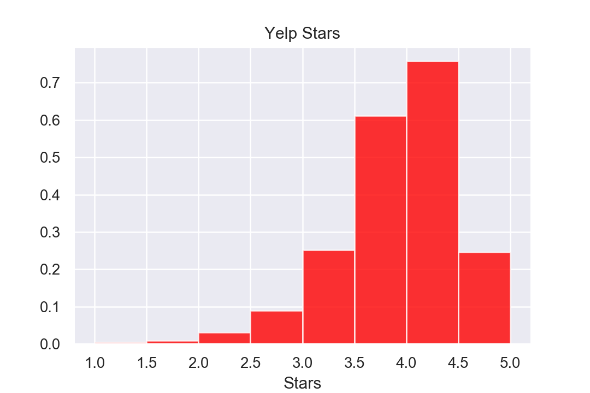
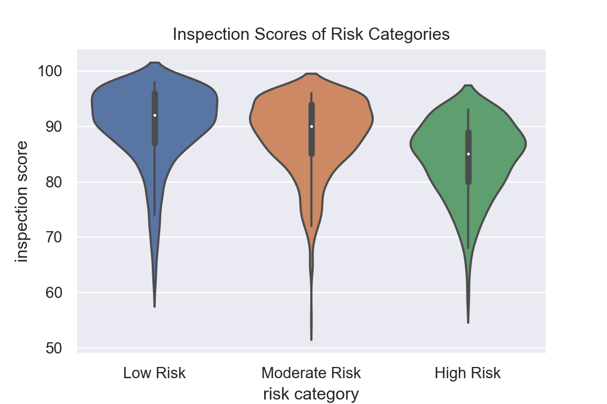

# San Francisco Restaurant Project
## Data Analysis of San Francisco Restaurants 

### Authors: Sam Sheridan, Sudarshan Kannan, Ronak Parikh, Alex Xu, Inwoong Bae, Manpal Sidhu

## Abstract
We aim to predict the Yelp user rating (stars) that a user will leave based off health code data from the city of San Francisco and restaurant information collected from the Yelp Fusion API. We matched the San Francisco Restaurant Health Data with their respective yelp information to build a combined data frame. This data frame serves the basis for our analysis and modeling. 

## Motivation
We wanted to examine the trends between location, rating, and health inspection score for restaurants in San Francisco while improving our data collection/api interaction skillset.  

## Methodology
### Recovering the Data and Merging the Datasets
The San Francisco Health Data was a readily available CSV containing restaurant names, geographic data, health inspection scores,  and health risk.  The rest of the data — such as ratings, review counts, hours, category, etc — was obtained by matching each restaurant in the CSV to its corresponding yelp entry. To properly acquire the data from Yelp, we wrote custom functions to query API for entries in our dataframe. Apifuncs1.0.py  was our first attempt at writing these functions, The final retrieval functions can be found in DataCollector.py and yelppull.py. The function data_collector() in DataCollector.py works by using yelps business match api function to match the restaurants from the CSV to a business id. The business id is used to pull the restaurant information from yelp. The program yelppull.py makes data_collector() easily runnable from the command line and safeguards the data retrieval process — which took over an hour for our csv. Our functions dumped the data collected from yelp in a list whose indices matched our initial cleaned CSV. The necessary data for each restaurant could be extracted from its matching index in the list. 

### Cleaning the Data
The initial data set contained multiple entries for each business based on the time of inspection. The data was sorted by time and only the most recent inspection scores for each restaurant were kept. The data collection functions returned 0 whenever a match was not found, so unmatched data was easily dropped. Some of the missing data from the initial csv was easily recoverable given that other parts of the data allowed us to find the missing pieces.  In particular, many places did not have a listed zip code, but using the google maps API, we were able to reverse geocode (using the Maps API) the GPS coordinates and obtain zip codes. The ‘categories’ were a little trickier. The categories column lists all possible classifications of a restaurant as a string; for example, Chipotle would have ‘Mexican burritos fast food’. We decided to break up the string and isolate the different labels, taking only the most common ones. 

### EDA and Initial Graphical Analysis

  
  
  
   

### Future works 
We are in the process of building a predictive model for restaurant ratings. Our success wtih regessors has been dismal so far as our varisbles lack strong correlation. We're exhausting our regression options and are attemping Random Forest Models before we move on to a nueral network for our final modeling attempt. 
